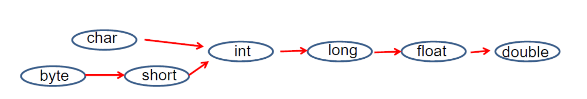
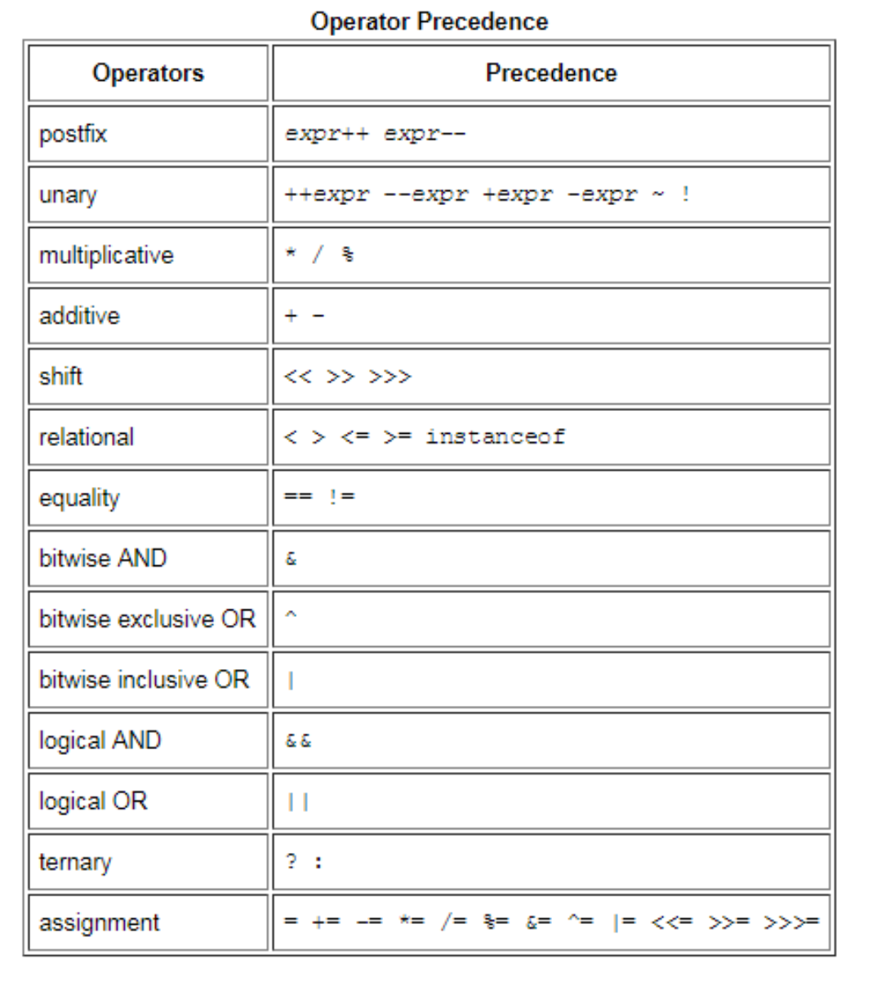

# Chapter I: Syntax
  * Keywords
  * Variables
  * Operators
  * String

## 1. Keywords
|Key Words| | | | | |
|---|---|---|---|---|---|
|abstract|assert|boolean|break|byte|case|
|catch|char|class|const|continue|default|
|do|double|else|enum|extends|final|
|finally|float|for|goto|if|implements|
|import|instanceof|int|interface|long|native|
|new|package|private|protected|public|return|
|short|static|strictfp|super|switch|synchronized|
|this|throw|throws|transient|try|void|
|volatile|while| | | | |

Note: `goto` is a reserved keyword that has not been used.

## 2. Variables

2.1 Types: primitive type and reference type

* **primitive type**: ``boolean, char, byte, short, int, long, float, double``.
* **reference type**: class, interface, array \[\].

2.2 Primitive type

| Type | Size | Range | Default Value |
| --- | --- | --- | --- |
| byte | 1 byte | -128 to 127 | 0 |
| char | 2 byte | 0 to 65536 | '\u0000' |
| short | 2 byte | -32768 to 32767 | 0 |
| int | 4 byte | -2^31 to 2^31-1 \(about 2 billion\) | 0 |
| long | 8 byte | -2^63 to 2^63-1 \(about 8\*10^18\) | 0L |
| float | 4 byte | 3.4\*10E38F | 0.0F |
| double | 8 byte | 1.79\*10E308 | 0.0 |
| boolean | undefined | true or false | false |

* Only instance variable has default value.
* For local variable, it must be initialized.
* All reference type \(instance variable\): default value is null.

2.2.1 Type Conversion


* byte, char, and short are all convert to int.
* boolean cannot be converted to any type.

Example: ``s += i vs s = s + i``

* 1) ``+=`` compound operator will do implicity conversion, no compilation error. so when data is overflow, you will get a wrong result but code runs well.
* 2) ``=`` will do data type check, you will see compilation error if data types are mismatch in two sides


``` 
short s = 1;
int i = 123456;
s += i; // no compilation error, return wrong result (-7615)
s = s + i // compilation error
```

## 3. Operators


Ex1: short-circuit
* The && and || operators "short-circuit", meaning they don't evaluate the right hand side if it isn't necessary.
* The & and | operators, when used as logical operators, always evaluate both sides.
```java
public class Test {
    static int a = 5;
    static int b = 6;
    static int c = 7;
    static int d = 8;

public static void main(String[] args) {
    testOR();
    testAND();
}

private static void testOR() {
    if (true | m1()) {
    System.out.println(a); // 10
    }
    // "||" will stop once it finds the first "true"
    if (true || m2()) {
    System.out.println(b); // 6
    }
}
private static void testAND() {
    if ((false & n1()) == false) {
    System.out.println(c); // 14
    }
    // "&&" will stop once it finds the first "false"
    if ((false && n2()) == false) {
    System.out.println(d); // 8
    }
}
private static boolean m1() {
    a = 10;
    return true;
}
private static boolean m2() {
    b = 12;
    return true;
}
private static boolean n1() {
    c = 14;
    return true;
}
private static boolean n2() {
    d = 16;
    return true;
}
}
```
## 4. String

Ex1: Convert int to String

```
// bad
String s = intValue + "";

// good
String s = String.valueOf(intValue);
```

Ex2: Print string as chars

```
String s = "Hello World";
IntStream stream = s.chars();
stream.forEach(p -> System.out.println(String.valueOf(p)));
```

Ex3: String concat

```
String s1 = "Hello";
String s2 = "World";

//
System.out.println(s1.concat(" ").concat(s2));

// bad implementation
String s = s1 + " " + s2;
System.out.println(s);

// Better solution
StringBuilder sb = new StringBuilder();
System.out.println(sb.append(s1).append(" ").append(s2).toString());

// good solution (delimiter with " ")
StringJoiner stringJoiner = new StringJoiner(" ");
System.out.println(stringJoiner.add(s1).add(s2));

// delimiter with ","
StringJoiner sj = new StringJoiner(",");
System.out.println(sj.add("one").add("two").add("three"));

// delimiter with "," and start with "{" and end with "] "
StringJoiner sj1 = new StringJoiner(",","{","]");
System.out.println(sj1.add("one").add("two").add("three"));

//
System.out.println(String.join(",", "one", "two", "three"));
```

Ex4: **String equals**

```
//Bad:
args.equals("local");

//Good: avoid null pointer exception
"local".equals(args);

// google guava
Object.equals(obj1, obj2);
```

Ex5: **StringBuilder vs StringBuffer**

```
StringBuilder is faster but not thread-safe.
StringBuffer is slower but thread-safe.

Usually, StringBuilder is used to build string.
```
