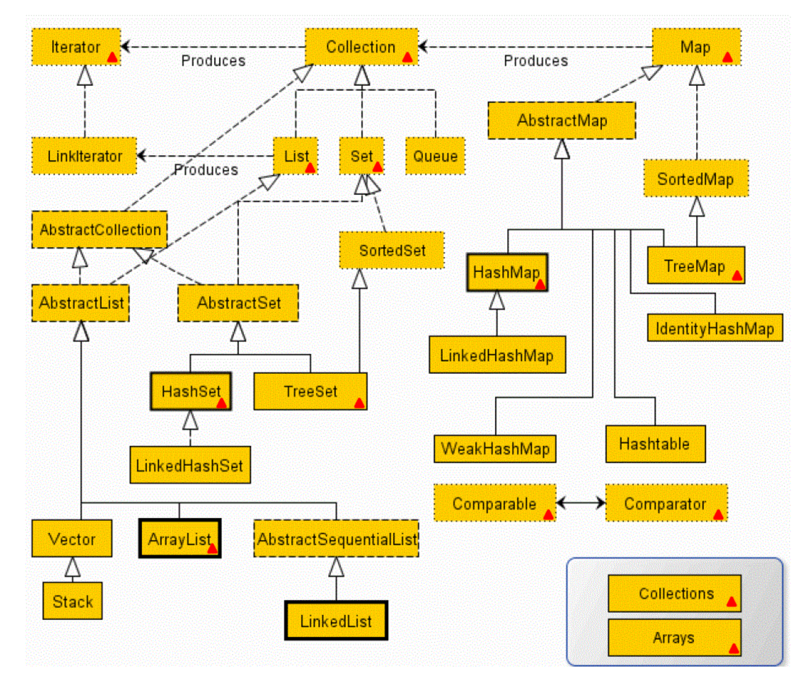
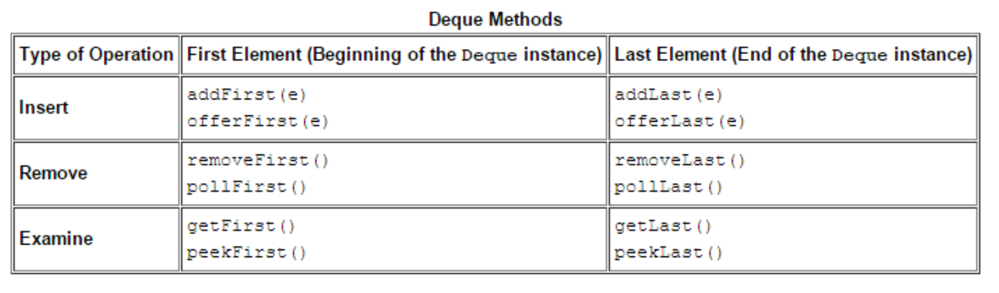
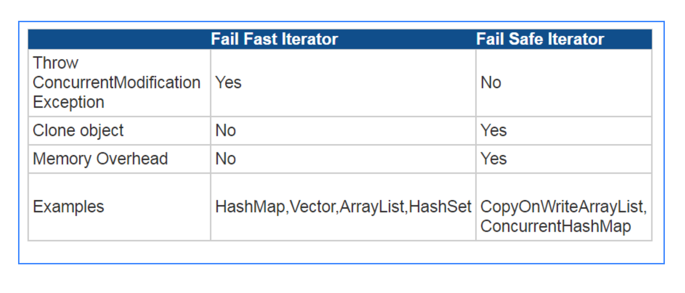

# Chapter IV: Collections
  1. [Interface Structure](#1-interface-structure)
  2. The Collection Interface
  3. Set
  4. List
  5. Map


## 1. Interface Structure
Core Interfaces:


Completed Inheritance Structure:



* Advantages of Collection Framework:
    * Consistent API : The API has a basic set of interfaces like Collection, Set, List, or Map. All classes (ArrayList, 
    LinkedList, Vector, etc) that implement these interfaces have some common set of methods.
    * Reduces programming effort: A programmer doesn’t have to worry about the design of Collection, and he can focus on its 
    best use in his program.
    * Increases program speed and quality: Increases performance by providing high-performance implementations of useful data 
    structures and algorithms.

### 1.1 Collection
The root of the collection interface hierarchy. A collection represents a group of objects known as its elements. 
Collections may have one or some following properties:

* Allow duplicate elements
* Do not allow duplicate elements: **Set** / **Map** (no duplicate keys)
* Maintain elements inserted order
* Do not maintain elements inserted order
* Sorted
* Unsorted
* First-in, first-out (FIFO)
* Last-in, first-out (LIFO)

### 1.2 Set
A collection that cannot contain duplicate elements.

### 1.3 List
An ordered collection (sometimes called a sequence). Lists can contain duplicate elements. 
The user of a List generally has precise control over where in the list each element is inserted and 
can access elements by their integer index (position).

### 1.4 Queue
A collection used to hold multiple elements prior to processing. It can order elements in a FIFO (first-in, first-out) manner.

### 1.5 Deque
A collection used to hold multiple elements prior to processing. Deques can be used both as FIFO (first-in, first-out) 
and LIFO (last-in, first-out). It implements both stacks and queues at the same time.

### 1.6 Map
An object that maps keys to values. A Map cannot contain duplicate keys; each key can map to at most one value.

The last two core collection interfaces are merely sorted versions of Set and Map:

### 1.7 SortedSet
A Set that maintains its elements in ascending order.

### 1.8 SortedMap
A map that maintains its mappings in ascending key order. Sorted maps are used for naturally ordered collections of 
key/value pairs, such as dictionaries and telephone directories.


## 2. The Collection Interface
### 2.1 Features
* Store a group of objects.
* Varied-size
* **Cannot store primitive type data**
* **Un-synchronized** : basically all collection type are un-synchronized. Only these three are synchronized: 
Hashtable (not from collection), Vector, Stack.
* To make a collection synchronized: `Collections.synchronizedCollection(Collection<T> c)`

### 2.2 Traversing Collections
1. Use for-each construct
2. Use Iterators
3. Use aggregate operations (JDK 8)

* for-each construct
    ```
    for (Object o : collection) { system.out.println(o)}
    ```

* Iterators
    ```
    public interface Iterator<E> {
    boolean hasNext();
    E next();
    void remove(); //optional
    }
    ```
    
    * The remove method removes the last element that was returned by next. The remove method may be called only once per call to next 
    and throws an exception if this rule is violated. 
    
    * **Note that Iterator.remove is the only safe way to modify a collection during iteration.**
    
    * Use Iterator instead of the for-each construct when you need to:
        * Remove the current element. The for-each construct hides the iterator, so you cannot call remove. 
        **Therefore, the for-each construct is not usable for filtering.**
        * Iterate over multiple collections in parallel.
    
        ```
        static void filter(Collection<?> c) {
        for (Iterator<?> it = c.iterator(); it.hasNext(); )
        if (!cond(it.next()))
        it.remove();
        }
        ```

* Aggregate Operations (Java 8)
    ```
    myShapesCollection.stream()
    .filter(e -> e.getColor() == Color.RED)
    .forEach(e -> System.out.println(e.getName()));
    ```

### 2.3 APIs
* Bulk Operations
* Array Operations

2.3.1 Bulk Operations

* **containsAll**: returns true if the target Collection contains all of the elements in the specified Collection.

* **addAll**: adds all of the elements in the specified Collection to the target Collection.

* **removeAll**: removes from the target Collection all of its elements that are also contained in the specified Collection.

* **retainAll**: removes from the target Collection all its elements that are not also contained in the specified Collection. That is, it retains only those elements in the target Collection that are also contained in the specified Collection.

* **clear**: removes all elements from the Collection.

2.3.2

* toArray ( )
* Arrays.asList ( )

The toArray methods are provided as a bridge between collections and older APIs that expect arrays on input. 
The array operations allow the contents of a Collection to be translated into an array.

```
// c is a Collection. Note:
Object[] a = c.toArray();

String[] a = c.toArray(new String[0]);
```

**Arrays.asList(): Returns a fixed-size list backed by the specified array.** 
(Changes to the returned list "write through" to the array.) This method acts as bridge between array-based a
nd collection-based APIs, in combination with Collection.toArray(). The returned list is serializable and 
implements RandomAccess.

```
List<String> stooges = Arrays.asList("Larry", "Moe", "Curly");

stooges.add("Don"); // error(UnsupportedOperationException), stooges is an array object
```

Parameters:

* a - the array by which the list will be backed
* Returns:**a list view of the specified array**. It is not a list. So you cannot implement stooges.add().


### 2.4 How to write HashCode
```
hashCode = 31 * hashCode + (father == null ? 0 : father.hashCode());
hashCode = 31 * hashCode + depth;
hashCode = 31 * hashCode + cost;
hashCode = 31 * hashCode + matrix.hashCode();
hashCode = 31 * hashCode + java.util.Arrays.hashCode(coordinates);
```

## 3. Set
Set does not contain duplicate elements

* Un-sorted: HashSet  (do not keep insert order )
* Un-sorted: LinkedHashSet  (keep insert order )
* Sorted: TreeSet

### 3.1 HashSet
* Use hashCode and equals to check uniqueness  (element must override hashCode and equals methods )
* If hashCode is different, save element into HashSet. No need to check equals().
* If hashCode is same, but not equals, save element into HashSet.
* If both hashCode and equals are same, duplicate elements. Do not save it.
* HashSet permits null.

### 3.2 TreeSet
* Sorting method 1: Element itself comparable

* Element implements Comparable interface
* Override compareTo ( )
* If element itself has nature order, like String, no need to implement Comparable interface.

* Sorting method 2: Construct TreeSet with Comparator

* Create a customized comparator class which implements Comparator interface
* Override compare ( ) method
* Note: TreeSet's comparator will override object's compareTo ( ) method.

    ```
    public class ComparatorByLength implements Comparator {
        @Override
        public int compare(Object o1, Object o2) {
        String s1 = (String)o1;
        String s2 = (String)o2;
    
        int temp = s1.length()-s2.length();
        return temp==0? s1.compareTo(s2): temp;
        // return 1; // keep inserting order
        // return -1 // keep inverse-inserting order
        }
    }
    
    TreeSet ts = new TreeSet(new ComparatorByLength());
    ```

## 4. List
* Array: It is simple fixed size arrays that can contains both primitive data and object. 
* List List only supports objects.
* Vector:synchronized, CRUD performance is low.
* ArrayList: dynamic size array, un-synchronized, CRUD performance is faster than Vector  (designed to replace vector ). 
Read and update are faster than LinkedList. Write in sequence is faster than LinkedList. It is not good for 
random add and delete elements.
* LinkedList:un-synchronized, random add and delete are faster than ArrayList。

* LinkedList VS ArrayList
    * LinkedList store elements within a doubly-linked list data structure.
    * LinkedList allows for constant-time insertions or removals, but only sequential access of elements.
    * LinkedList costs more memory
    * ArrayList: allow random access, so you can grab any element in constant time.
    * ArrayList: random adding and removing are slower than LinkedList.

* ArrayList Auto resizing
    * Each ArrayList instance has a capacity. The capacity is the size of the array used to store the elements in 
    the list. It is always at least as large as the list size. As elements are added to an ArrayList, its capacity 
    grows automatically. The details of the growth policy are not specified beyond the fact that adding an 
    element has constant amortized time cost.

## 5. Map
* Map：adds  (key, value ), whereas Collection adds element.
* **key must be unique**
* **key can be null, but can only have one**
    * HashMap does not call hashcode when null is passed as key and null Key is handled as special case.
    * `Put Method`: HashMap puts null key in bucket 0 and maps null as key to passed value. HashMap does it by linked 
    list data structure. HashMap uses linked list data structure internally. Linked list data structure used by HashMap 
    (a static class in HashMap.java)
        ```
        static class Entry<K,V> implements Map.Entry<K,V> {
                final K key;
                V value;
                Entry<K,V> next;
                final int hash;
        }
        ```
        In Entry class the K is set to null and value mapped to value passed in put method.
    
    * `Get Method`: While in Hashmap get method the checks if key is passed as null. Search Value for null key 
    in bucket 0. Hence there can only be one null key in one hashmap object.

### 5.1 APIs
* Add
```
put(K key, V value)
// Return: Associates the specified value with the specified key in this map (optional // operation).
```

* Delete
```
void clear()// Removes all of the mappings from this map (optional operation).
value remove(key)//Removes the mapping for a key from this map if it is present (optional operation).
```

* Check
```
boolean containsKey(key)//Returns true if this map contains a mapping for the specified key.
boolean containsValue(value)//Returns true if this map maps one or more keys to the specified value.
boolean isEmpty()//Returns true if this map contains no key-value mappings.
```

* Get
```
value get(key)//Returns the value to which the specified key is mapped, or null if this map contains no mapping for the key.
int size()//Returns the number of key-value mappings in this map.
```

### 5.2 Implementations
* Hashtable :Synchronized, **null cannot be key or value**.
* HashMap : Un-synchronized and permits one null key and any number of null values. 
If you store the same key, like null, the value will be updated.
* LinkedHashMap: it is similar to HashMap, but keeps insert order.
* TreeMap : The TreeMap is sorted according to the natural ordering of its keys, or by a Comparator provided at map creation time, 
depending on which constructor is used.
* HashMap and HashTable check key  (check both hasCode and equals )

    ```
    if (key1.hashCode() == key2.hashCode() && key1.equals(key2)) { return true;}
    ```

* HashMap and HashTable check value  (only check equals )

    ```
    if (value1.equals(value2)) { return true;}
    ```
* About `null` key in `HashTable` and `HashTable`:
    * To successfully store and retrieve objects from a HashTable, the objects used as keys must implement the hashCode method and 
    the equals method. Since null is not an object, it can't implement these methods.
    * `HashMap` has a defensive check for null key. If key == null, it won't implement `hashCode()`, but puts `null` key in bucket 0 and
    maps `null` as key to passed value.

* Declare a HashMap
```
// default values: initialCapacity = 16, loadFactor = 0.75
// when m.size() > initialCapacity * loadFactor, it will automatic auto resizing.
HashMap m = new HashMap(int initialCapacity, float loadFactor);
```
## 6. Queue

| Queue is empty | Queue is empty |
| --- | --- |
| add (e ): throws IllegalStateException | offer (e ): return false |
| remove ( ): throws NoSuchElementException | poll ( ): return null |
| element ( ): throws NoSuchElementException | peek ( ): return null |

## 7. Deque



## 8. Synchronization, Fail-fast and Fail-safe Iterators

### 8.1 Write a synchronized list
```
List list = new ArrayList(); //un-synchronized
list = MyCollections.synList(list);// return a synchronized list.

// add synchronization
class MyCollections{
    public static List synList(List list){ return new MyList(list); }
    private class MyList implements List{
        private List list;
        private static final Object lock = new Object();
        MyList(List list){ this.list = list; }

        public boolean add(Object obj){ synchronized(lock){ return list.add(obj);} }

        public boolean remove(Object obj){ synchronized(lock){ return list.remove(obj);} }
    }
}
```

### 8.2 Fail-fast and Fail-safe Iterators

**Concurrent Modification:** When more threads are iterating over a collection, in between, one thread changes the structure of 
the collection  (either adding the element to the collection or by deleting the element in the collection or by updating the 
value at particular position in the collection ) is known as Concurrent Modification.

**NOTE**: structural modification is any operation that **ADD** or **delete** element;
**NOT A STRUCTURAL MODIFICATION**: merely setting the value of an element  (in case of list ) or changing the value associated 
with an existing key  (in case of map ).

* Fail-fast iterator: when add or delete concurrent modification applies on a un-synchronized collection, fail-fast iterator 
throws ConcurrentModificationException.

* Fail-safe iterator: allows add or delete concurrent modification applies on a concurrent version of collection. 
Fail Safe Iterator makes copy of the internal data structure  (object array ) and iterates over the copied data structure. 
So , original data structure remains structurally unchanged. Hence , no ConcurrentModificationException throws by the fail 
safe iterator.

```
public class FailFastExample{
    public static void main(String[] args){
        Map<String,String> premiumPhone = new HashMap<String,String>();
        premiumPhone.put("Apple", "iPhone");
        premiumPhone.put("HTC", "HTC one");
        premiumPhone.put("Samsung","S5");

        Iterator iterator = premiumPhone.keySet().iterator();

        while (iterator.hasNext()){
            System.out.println(premiumPhone.get(iterator.next()));
            premiumPhone.put("Sony", "Xperia Z");
        }
    }
}

// Output:
iPhone
Exception in thread "main" java.util.ConcurrentModificationException
at java.util.HashMap$HashIterator.nextEntry(Unknown Source)
at java.util.HashMap$KeyIterator.next(Unknown Source)
at FailFastExample.main(FailFastExample.java:20)
```

```
public class FailSafeExample{
    public static void main(String[] args){
        ConcurrentHashMap<String,String> premiumPhone = new ConcurrentHashMap<String,String>();
        premiumPhone.put("Apple", "iPhone");
        premiumPhone.put("HTC", "HTC one");
        premiumPhone.put("Samsung","S5");

        Iterator iterator = premiumPhone.keySet().iterator();

        while (iterator.hasNext()){
            System.out.println(premiumPhone.get(iterator.next()));
            premiumPhone.put("Sony", "Xperia Z");
        }
    }
}
// Output:
S5
HTC one
iPhone
```



## 9. Collections
Collections is a class that consists exclusively of static methods that operate on or return collections. It contains polymorphic 
algorithms that operate on collections, "wrappers", which return a new collection backed by a specified collection, 
and a few other odds and ends.

It provides manipulations on Set, List, Map, etc.

### 9.1 Sort Operation
* reverse (List )
* shuffle (List )
* sort (List )
* sort (List，Comparator )
* swap (List，int， int )

### 9.2 Search and Replace
* Object max (Collection )
* Object max (Collection，Comparator )
* Object min (Collection )
* Object min (Collection，Comparator )
* int frequency (Collection，Object )
* boolean replaceAll (List list，Object oldVal，Object newVal )

### 9.3 Synchronized Methods
```
Collections.synchronizedCollection(Collection<T> c)
Collections.synchronizedList(List<T> c)
Collections.synchronizedSet(Set<T> c)
Collections.synchronizedSortedSet(SortedSet<T> c)
Collections.synchronizedMap(Map<T> c)
Collections.synchronizedSortedMap(SortedMap<T> c)
```

### 9.4 Algorithms
The polymorphic algorithms described here are pieces of reusable functionality provided by the Java platform. All of them come 
from the Collections class, and all take the form of static methods whose first argument is the collection on which the operation 
is to be performed. The great majority of the algorithms provided by the Java platform operate on List instances, but a few of 
them operate on arbitrary Collection instances. This section briefly describes the following algorithms:

* Sorting
* Shuffling
* Routine Data Manipulation
* Searching
* Composition
* Finding Extreme Values

**Sorting**

The sort algorithm reorders a List so that its elements are in ascending order according to an ordering relationship.

    * sort (List )
    * sort (List，Comparator )

The sort operation uses a slightly optimized **merge sort** algorithm that is fast and stable:

* **Fast**: It is guaranteed to run in `nlog(n)` time and runs substantially faster on nearly sorted lists. Empirical tests showed 
it to be as fast as a highly optimized quicksort. A quicksort is generally considered to be faster than a merge sort but isn't stable 
and doesn't guarantee `nlog(n)` performance.
* **Stable**: It doesn't reorder equal elements. This is important if you sort the same list repeatedly on different attributes. 
If a user of a mail program sorts the inbox by mailing date and then sorts it by sender, the user naturally expects 
that the now-contiguous list of messages from a given sender will  (still ) be sorted by mailing date. 
This is guaranteed only if the second sort was stable.
* **Quicksort** can be used to primitive type data which does not have stable issue.

The following trivial program prints out its arguments in lexicographic  (alphabetical ) order.

```java
public class Sort {
    public static void main(String[] args) {
        List<String> list = Arrays.asList(args);
        Collections.sort(list);
        System.out.println(list);
    }
}
```

Let's run the program.

```
% java Sort i walk the line
```

The following output is produced:

```
[i, line, the, walk]
```

The second form of sort takes a `Comparator` in addition to a List and sorts the elements with the Comparator.

Recall that the anagram groups are stored as values in a Map, in the form of List instances. The revised printing code iterates through 
the Map's values view, putting every List that passes the minimum-size test into a List of Lists. Then the code sorts this List, using a 
Comparator that expects List instances, and implements reverse size-ordering. Finally, the code iterates through the sorted List, 
printing its elements  (the anagram groups ). The following code replaces the printing code at the end of the main method in the Anagrams example.

```
// Make a List of all anagram groups above size threshold.
List<List<String>> winners = new ArrayList<List<String>>();
for (List<String> l : m.values())
if (l.size() >= minGroupSize)
winners.add(l);

// Sort anagram groups according to size
Collections.sort(winners, new Comparator<List<String>>() {
public int compare(List<String> o1, List<String> o2) {
return o2.size() - o1.size();
}});

// Print anagram groups.
for (List<String> l : winners)
System.out.println(l.size() + ": " + l);
```

Running the program on the same dictionary as in The Map Interface section, with the same minimum anagram group size  (eight ), 
produces the following output.

```
12: [apers, apres, asper, pares, parse, pears, prase, presa, rapes, reaps, spare, spear]
11: [alerts, alters, artels, estral, laster, ratels,salter, slater, staler, stelar, talers]
10: [least, setal, slate, stale, steal, stela, taels,tales, teals, tesla]
9: [estrin, inerts, insert, inters, niters, nitres, sinter, triens, trines]
9: [capers, crapes, escarp, pacers, parsec, recaps,scrape, secpar, spacer]
9: [palest, palets, pastel, petals, plates, pleats,septal, staple, tepals]
9: [anestri, antsier, nastier, ratines, retains, retinas,retsina, stainer, stearin]
8: [lapse, leaps, pales, peals, pleas, salep, sepal, spale]
8: [aspers, parses, passer, prases, repass, spares,sparse, spears]
8: [enters, nester, renest, rentes, resent, tenser,ternes,treens]
8: [arles, earls, lares, laser, lears, rales, reals, seral]
8: [earings, erasing, gainers, reagins, regains, reginas,searing, seringa]
8: [peris, piers, pries, prise, ripes, speir, spier, spire]
8: [ates, east, eats, etas, sate, seat, seta, teas]
8: [carets, cartes, caster, caters, crates, reacts,recast,traces]
```

**Shuffling**

The shuffle algorithm does the opposite of what sort does, destroying any trace of order that may have been present in a List. 
That is, this algorithm reorders the List based on input from a source of randomness such that all possible permutations occur 
with equal likelihood, assuming a fair source of randomness. This algorithm is useful in implementing games of chance. 
For example, it could be used to shuffle a List of Card objects representing a deck. Also, it's useful for generating test cases.

This operation has two forms: one takes a List and uses a default source of randomness, and the other requires the caller to provide a 
Random object to use as a source of randomness. The code for this algorithm is used as an example in the List section.

**Routine Data Manipulation**
The Collections class provides five algorithms for doing routine data manipulation on List objects, all of which are pretty straightforward:

* reverse — reverses the order of the elements in a List.
* fill — overwrites every element in a List with the specified value. This operation is useful for reinitializing a List.
* copy — takes two arguments, a destination List and a source List, and copies the elements of the source into the destination, overwriting its contents. The destination List must be at least as long as the source. If it is longer, the remaining elements in the destination List are unaffected.
* swap — swaps the elements at the specified positions in a List.
* addAll — adds all the specified elements to a Collection. The elements to be added may be specified individually or as an array.

**Searching**
The binarySearch algorithm searches for a specified element in a sorted List. This algorithm has two forms.

* Collections.binarySearch (list, key )
* Collections.binarySearch (list, key, comparator )

The return value is the same for both forms.

* If the List contains the search key, its index is returned.
* If not, the return value is  (- (insertion point ) - 1 ), where the insertion point is the point at which the value would be 
inserted into the List, or the index of the first element greater than the value or `list.size()` if all elements in the List are 
less than the specified value. This admittedly ugly formula guarantees that the return value will be &gt;= 0 if and only if 
the search key is found. It's basically a hack to combine a boolean  (found ) and an integer  (index ) into a single int return value.

The following idiom, usable with both forms of the binarySearch operation, looks for the specified search key and inserts it at 
the appropriate position if it's not already present.

```
int pos = Collections.binarySearch(list, key);
if (pos < 0) {
 l.add(-pos-1, key);
}
```

**Composition**

The frequency and disjoint algorithms test some aspect of the composition of one or more Collections:

* frequency — counts the number of times the specified element occurs in the specified collection
* disjoint — determines whether two Collections are disjoint; that is, whether they contain no elements in common

**Finding Extreme Values**

The min and the max algorithms return, respectively, the minimum and maximum element contained in a specified Collection. 
Both of these operations come in two forms. The simple form takes only a Collection and returns the minimum  (or maximum ) 
element according to the elements' natural ordering. The second form takes a Comparator in addition to the Collection and 
returns the minimum  (or maximum ) element according to the specified Comparator.

## 10. Custom Collection Implementations

**Reasons to Write an Implementation**
* Persistent
* Application-specific
* High-performance, special-purpose
* High-performance, general-purpose
* Enhanced functionality
* Convenience
* Adapter

**How to Write a Custom Implementation**

The Java Collections Framework provides abstract implementations designed expressly to facilitate custom implementations.

```
public static <T> List<T> asList(T[] a) {
    return new MyArrayList<T>(a);
}

private static class MyArrayList<T> extends AbstractList<T> {
    private final T[] a;
    MyArrayList(T[] array) {
    a = array;
}

public T get(int index) {
    return a[index];
}

public T set(int index, T element) {
    T oldValue = a[index];
    a[index] = element;
    return oldValue;
}

public int size() {
    return a.length;
}
}
```

Believe it or not, this is very close to the implementation that is contained in ``java.util.Arrays``. It's that simple! 
You provide a constructor and the get, set, and size methods, and AbstractList does all the rest. You get the ListIterator, 
bulk operations, search operations, hash code computation, comparison, and string representation for free.

Suppose you want to make the implementation a bit faster. The API documentation for abstract implementations describes 
precisely how each method is implemented, so you'll know which methods to override to get the performance you want. 
The preceding implementation's performance is fine, but it can be improved a bit. In particular, the toArray method 
iterates over the List, copying one element at a time. Given the internal representation, it's a lot faster and 
more sensible just to clone the array.

```
public Object[] toArray() {
    return (Object[]) a.clone();
}
```

With the addition of this override and a few more like it, this implementation is exactly the one found in `java.util.Arrays`. 
In the interest of full disclosure, it's a bit tougher to use the other abstract implementations because you will have to 
write your own iterator, but it's still not that difficult.

The following list summarizes the abstract implementations:

* AbstractCollection — a Collection that is neither a Set nor a List. At a minimum, you must provide the iterator 
and the size methods.
* AbstractSet — a Set; use is identical to AbstractCollection.
* AbstractList — a List backed up by a random-access data store, such as an array. At a minimum, you must provide 
the positional access methods  (get and, optionally, set, remove, and add ) and the size method. The abstract class 
takes care of listIterator  (and iterator ).
* AbstractSequentialList — a List backed up by a sequential-access data store, such as a linked list. At a minimum, 
you must provide the listIterator and size methods. The abstract class takes care of the positional access methods.  
(This is the opposite of AbstractList. )
* AbstractQueue — at a minimum, you must provide the offer, peek, poll, and size methods and an iterator supporting remove.
* AbstractMap — a Map. At a minimum you must provide the entrySet view. This is typically implemented with the 
AbstractSet class. If the Map is modifiable, you must also provide the put method.

The process of writing a custom implementation follows:

* Choose the appropriate abstract implementation class from the preceding list.
* Provide implementations for all the abstract methods of the class. If your custom collection is to be modifiable, 
you will have to override one or more of the concrete methods as well. The API documentation for the abstract 
implementation class will tell you which methods to override.
* Test and, if necessary, debug the implementation. You now have a working custom collection implementation.
* If you are concerned about performance, read the API documentation of the abstract implementation class for 
all the methods whose implementations you're inheriting. If any seem too slow, override them. If you override any methods, be sure to measure the performance of the method before and after the override. How much effort you put into tweaking performance should be a function of how much use the implementation will get and how critical to performance its use is.  (Often this step is best omitted. )

## 11. Interoperability

* **Compatibility**: This subsection describes how collections can be made to work with older APIs that predate 
the addition of Collections to the Java platform.
* **API Design**: This subsection describes how to design new APIs so that they will interoperate seamlessly with one another.

### 11.1 Compatibility

The Java Collections Framework was designed to ensure complete interoperability between the core collection 
interfaces and the types that were used to represent collections in the early versions of the Java platform: 
Vector, Hashtable, array, and Enumeration. In this section, you'll learn how to transform old collections to the 
Java Collections Framework collections and vice versa.

**Upward Compatibility**

Suppose that you're using an API that returns legacy collections in tandem with another API that requires objects implementing 
the collection interfaces. To make the two APIs interoperate smoothly, you'll have to transform the legacy collections into 
modern collections. Luckily, the Java Collections Framework makes this easy.

Suppose the old API returns an array of objects and the new API requires a Collection. The Collections Framework has a 
convenience implementation that allows an array of objects to be viewed as a List. You use Arrays.asList to pass an array 
to any method requiring a Collection or a List.

```
Foo[] result = oldMethod(arg);
newMethod(Arrays.asList(result));
```

If the old API returns a Vector or a Hashtable, you have no work to do at all because Vector was retrofitted to implement 
the List interface, and Hashtable was retrofitted to implement Map. Therefore, a Vector may be passed directly to any method 
calling for a Collection or a List.

```
Vector result = oldMethod(arg);
newMethod(result);
```

Similarly, a Hashtable may be passed directly to any method calling for a Map.

```
Hashtable result = oldMethod(arg);
newMethod(result);
```

Less frequently, an API may return an Enumeration that represents a collection of objects. The Collections.list method 
translates an Enumeration into a Collection.

```
Enumeration e = oldMethod(arg);
newMethod(Collections.list(e));
```

**Backward Compatibility**

Suppose you're using an API that returns modern collections in tandem with another API that requires you to pass in legacy 
collections. To make the two APIs interoperate smoothly, you have to transform modern collections into old collections. 
Again, the Java Collections Framework makes this easy.

Suppose the new API returns a Collection, and the old API requires an array of Object. As you're probably aware, the 
Collection interface contains a toArray method designed expressly for this situation.

```
Collection c = newMethod();
oldMethod(c.toArray());
```

What if the old API requires an array of String  (or another type ) instead of an array of Object? You just use 
the other form of toArray — the one that takes an array on input.

```
Collection c = newMethod();
oldMethod((String[]) c.toArray(new String[0]));
```
If the old API requires a Vector, the standard collection constructor comes in handy.

```
Collection c = newMethod();
oldMethod(new Vector(c));
```

The case where the old API requires a Hashtable is handled analogously.

```
Map m = newMethod();
oldMethod(new Hashtable(m));
```

Finally, what do you do if the old API requires an Enumeration? This case isn't common, but it does happen from time 
to time, and the Collections.enumeration method was provided to handle it. This is a static factory method that takes a 
Collection and returns an Enumeration over the elements of the Collection.

```
Collection c = newMethod();
oldMethod(Collections.enumeration(c));
```

### 11.2 API Design

In this short but important section, you'll learn a few simple guidelines that will allow your API to interoperate 
seamlessly with all other APIs that follow these guidelines. In essence, these rules define what it takes to be a 
good "citizen" in the world of collections.

**Parameters**

* If your API contains a method that requires a collection on input, it is of paramount importance that you declare the 
relevant parameter type to be one of the collection interface types. Never use an implementation type because this defeats 
the purpose of an interface-based Collections Framework, which is to allow collections to be manipulated without regard 
to implementation details.

* Further, you should always use the least-specific type that makes sense. For example, don't require a List or a 
Set if a Collection would do. It's not that you should never require a List or a Set on input; it is correct to do 
so if a method depends on a property of one of these interfaces. For example, many of the algorithms provided by 
the Java platform require a List on input because they depend on the fact that lists are ordered. As a general rule, 
however, the best types to use on input are the most general: Collection and Map.

* **Caution**: Never define your own ad hoc collection class and require objects of this class on input. 
By doing this, you'd lose all the benefits provided by the Java Collections Framework.

**Return Values**

* You can afford to be much more flexible with return values than with input parameters. It's fine to return an 
object of any type that implements or extends one of the collection interfaces. This can be one of the interfaces or 
a special-purpose type that extends or implements one of these interfaces.

* For example, one could imagine an image-processing package, called ImageList, that returned objects of a new class 
that implements List. In addition to the List operations, ImageList could support any application-specific operations 
that seemed desirable. For example, it might provide an indexImage operation that returned an image containing thumbnail 
images of each graphic in the ImageList. It's critical to note that even if the API furnishes ImageList instances on output, 
it should accept arbitrary Collection  (or perhaps List ) instances on input.

* In one sense, return values should have the opposite behavior of input parameters: It's best to return the most 
specific applicable collection interface rather than the most general. For example, if you're sure that you'll 
always return a SortedMap, you should give the relevant method the return type of SortedMap rather than Map. 
SortedMap instances are more time-consuming to build than ordinary Map instances and are also more powerful. 
Given that your module has already invested the time to build a SortedMap, it makes good sense to give the user 
access to its increased power. Furthermore, the user will be able to pass the returned object to methods that demand 
a SortedMap, as well as those that accept any Map.

**Legacy APIs**

There are currently plenty of APIs out there that define their own ad hoc collection types. While this is unfortunate, 
it's a fact of life, given that there was no Collections Framework in the first two major releases of the Java platform. 
Suppose you own one of these APIs; here's what you can do about it.

* If possible, retrofit your legacy collection type to implement one of the standard collection interfaces. 
Then all the collections you return will interoperate smoothly with other collection-based APIs. If this is impossible  
(for example, because one or more of the preexisting type signatures conflict with the standard collection interfaces ), 
define an adapter class that wraps one of your legacy collections objects, allowing it to function as a standard collection.  
(The Adapter class is an example of a custom implementation. )

* Retrofit your API with new calls that follow the input guidelines to accept objects of a standard collection interface, 
if possible. Such calls can coexist with the calls that take the legacy collection type. If this is impossible, 
provide a constructor or static factory for your legacy type that takes an object of one of the standard interfaces 
and returns a legacy collection containing the same elements  (or mappings ). Either of these approaches will 
allow users to pass arbitrary collections into your API.

## 12. Summary

* Array type collection：read fast.

* List type collection：add and delete fast，keep insert order.

* Hash type collection: override hashcode and equals to maintain uniqueness.

* Tree type collection：can be sorted by Comparable or Comparator.

* All collection type are un-synchronized except these three are synchronized Hashtable  (not from collection ), Vector, Stack. 
To make a collection synchronized:

```
Collections.synchronizedCollection(Collection<T> c)
```
